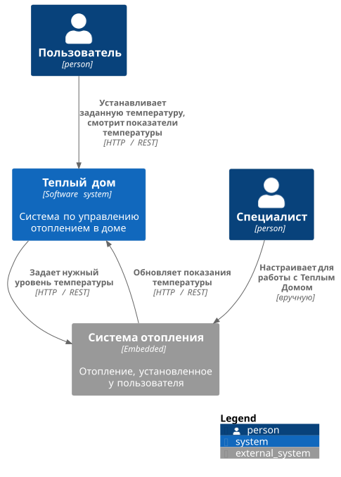

Это шаблон для решения **первой части** проектной работы. Структура этого файла повторяет структуру заданий. Заполняйте его по мере работы над решением.

# Задание 1. Анализ и планирование

Чтобы составить документ с описанием текущей архитектуры приложения, можно часть информации взять из описания компании условия задания. Это нормально.

### 1. Описание функциональности монолитного приложения

**Управление отоплением:**

- Пользователи могут удаленно включать/выключать отопление, устанавливать желаемую температуру;
- Система поддерживает управление по HTTP;
- В системе отсутствует проверка безопасности управления отоплением. Злоумышленник может перебрать id устройств и управлять температурой.

**Мониторинг температуры:**

- Пользователи могут просматривать текущую температуру через веб-интерфейс;
- Система поддерживает чтение показателей по HTTP. Чтобы получить актуальные данные, нужно переодически опрашивать сервис.

### 2. Анализ архитектуры монолитного приложения

- Язык программирования: Java (Spring);
- База данных: PostgreSQL;
- Архитектура: Монолитная, все компоненты системы (обработка запросов, бизнес-логика, работа с данными) находятся в рамках одного приложения;
- Взаимодействие: Синхронное (tcp / HTTP), запросы обрабатываются последовательно. Взаимодействие по REST;
- Масштабируемость: Ограничена, так как монолит сложно масштабировать по частям;
- Развёртывание: Требует остановки всего приложения.

### 3. Определение доменов и границы контекстов

#### Домен "Управление устройствами"

Поддомены описываются теми типами устройств, с которыми они работают. Например:
- поддомен управления отоплением;
- поддомен управления освещением;
- ...

Контексты к поддоменам добавляются в зависимости от функций: включение / выключение, выполнение более сложных задач (поставить освещенность заданной мощности).

#### Домен "Подключение новых устройств"

На данный момент подключение выполняется специалистом по выезду. 

Но в перспективе нужно выделить следующие поддомены и контексты:

- поддомен регистрации устройства:
  - контекст привязки устройства к пользователю;
  - контекст удаления устройства из устройств пользователя;
- поддомен настройки устройств:
  - контекст конфигурации новых устройств (например, добавление мета данных для последующей идентификации устройств при считывании показаний).

#### Домен "Обработка данных с устройств"

- поддомен сбора данных в режиме реального времени;
- поддомен агрегации данных, связывания данных с устройств с пользователем — на перспективу.

#### Домен "Мониторинга данных и аналитики"

- поддомен выдачи данных пользователю (отличается от сбора данных, принцип разбиения на запись и чтение CQRS);
- поддомен отчетности о работе устройств пользователю - на перспективу.

#### Домен "Управление пользователями"

В текущем решении, по крайней мере в коде, про пользователя ничего не сказано. Но чтобы достичь целевой архитектуры, данный домен необходим. 

- поддомен регистрации пользователей;
- поддомен нотификаций пользователей:
  - контексты строятся в зависимости от канала связи с пользователем.

### **4. Проблемы монолитного решения**

- Трудности с масштабированием. Запросов на запись (если говорить про считывание данных датчиков и запись их в БД), скорее всего, будет на порядки больше, чем запросов на чтение. Но монолитное приложение предполагает масштабирование только всего сразу. Получаем неэффективное использование ресурсов; 
- Сложности с деплоем новых версий — если поменяли только часть приложения, например, добавили поддержку нового устройства, необходимо передеплоить весь сервис. Деплоим весь сервис сразу — можем получить проблемы со стабильностью;
- Следуя легенде, проект будет активно расти. Работа нескольких команд с одним проектом может вызывать трудности с релизами, git конфликатами. 

### 5. Визуализация контекста системы — диаграмма С4

# Задание 2. Проектирование микросервисной архитектуры

В этом задании вам нужно предоставить только диаграммы в модели C4. Мы не просим вас отдельно описывать получившиеся микросервисы и то, как вы определили взаимодействия между компонентами To-Be системы. Если вы правильно подготовите диаграммы C4, они и так это покажут.

**Диаграмма контейнеров (Containers)**

Добавьте диаграмму.

**Диаграмма компонентов (Components)**

Добавьте диаграмму для каждого из выделенных микросервисов.

**Диаграмма кода (Code)**

Добавьте одну диаграмму или несколько.

# Задание 3. Разработка ER-диаграммы

Добавьте сюда ER-диаграмму. Она должна отражать ключевые сущности системы, их атрибуты и тип связей между ними.
